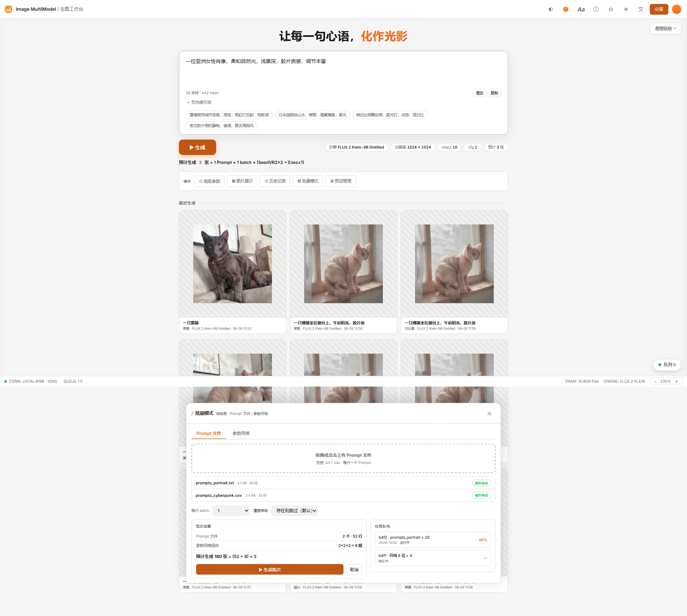
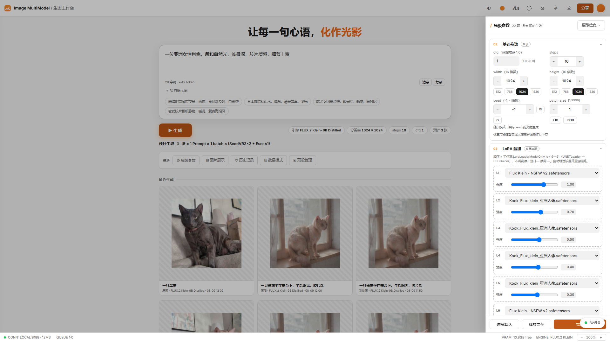
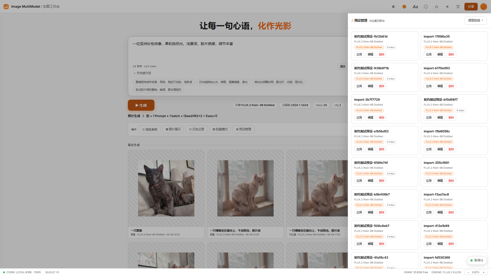
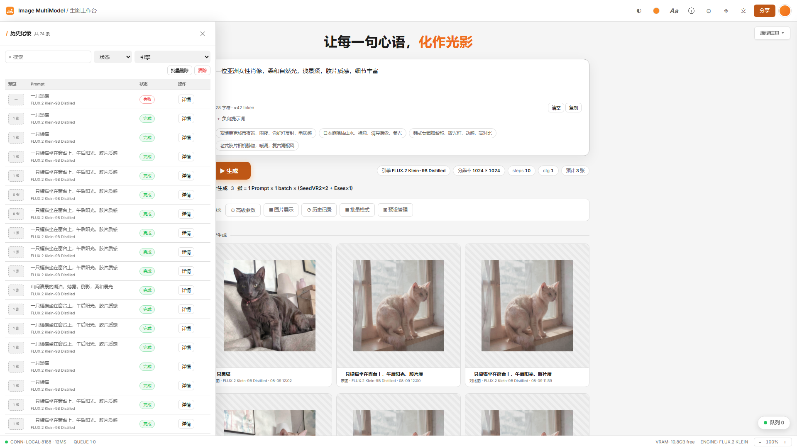
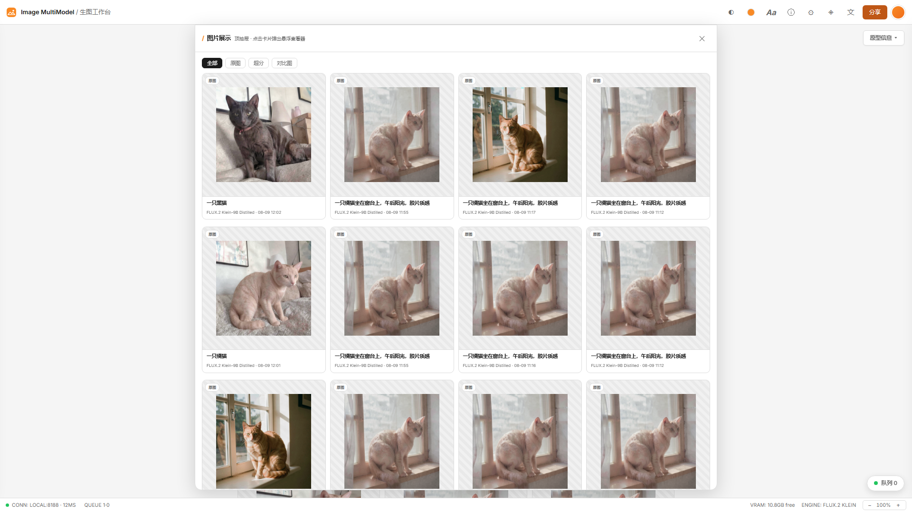
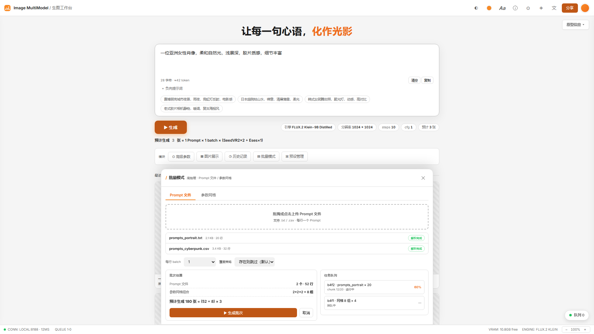

# Image MultiModel

    [](https://github.com/ReSerendipity/Image_MultiModel/actions)

**Image MultiModel — 多模型 AI 图像生成平台：基于进程内原生引擎，复用 ComfyUI 源码实现 Z-Image Turbo 推理的「单页 Web UI」**

> **Image MultiModel** — A unified AI image generation platform powered by the Z-Image Turbo workflow via a native in-process engine (reusing local ComfyUI source), fully decoupled from any external ComfyUI process.

***

## 界面预览

*浅色主题 — 生图工作台主页 / 高级参数 / 预设管理 / 历史记录 / 图片展示 / 批量模式*













***

## 功能亮点

| 特性                    | 说明                                                                                              |
| --------------------- | ----------------------------------------------------------------------------------------------- |
| **原生进程内引擎**           | 复用项目内 `comfy_kernel` 源码 + aki-v3 自定义节点，`sys.path` 注入后在同一进程内完成 加载→编码→采样→解码，**完全脱离外部 ComfyUI 进程** |
| **Z-Image Turbo 工作流** | 内置 Z Image Turbo（阿里通义）高速文生图工作流，支持六层 LoRA 叠加、SeedVR2 超分、Eses 双图对比、显存预留                           |
| **显存预检**              | 推理前自动估算 VRAM 需求，推荐精度（FP8/FP16）与 batch chunk 大小                                                  |
| **批量任务队列**            | 异步任务队列 + SSE 实时推送，支持批量生成、任务取消、断点恢复                                                              |
| **预设管理**              | 可保存常用参数组合为预设，一键加载复用                                                                             |
| **历史记录**              | SQLite 历史数据库，支持搜索、筛选、分页、结果预览                                                                    |
| **安全加固**              | PathGuard 路径防护、CSRF 中间件、Rate Limit 限流、任务签名完整性校验                                                 |
| **多语言界面**             | 内置中文、繁体中文、英文、日文、韩文五种语言                                                                          |

***

## 环境要求

| 项目         | 要求                                                                                                                          |
| ---------- | --------------------------------------------------------------------------------------------------------------------------- |
| **操作系统**   | Windows 10/11（推荐） / Linux                                                                                                   |
| **GPU**    | NVIDIA CUDA GPU（推荐 8GB+ VRAM）                                                                                               |
| **Python** | **两种方式均可**：• **推荐**：系统 Python 3.10+（3.12 最佳），需勾选 "Add Python to PATH"• **备选**：内置 WinPython（`WPy64-312101/`），完全隔离无需系统 Python |
| **推理引擎**   | 进程内原生引擎（复用项目内 `comfy_kernel` 源码），**无需外部 ComfyUI 进程**                                                                        |

***

## 快速开始

### 方式一：使用系统 Python（推荐，节省磁盘空间）

1. 安装 [Python 3.10+](https://www.python.org/downloads/)，推荐 3.12.x。安装时**务必勾选 "Add Python to PATH"**
2. 验证安装：打开命令提示符（CMD），运行：

   ```bat
   python --version
   ```

   应显示类似 `Python 3.12.x`
3. 双击运行 **`install.bat`**（会自动检测系统 Python，安装 PyTorch CUDA 版 + 全部依赖）
4. **（可选）配置环境变量**

   - **新手**：跳过此步，默认便携模式即可使用

   - **高级用户**：复制 `.env.example` 为 `.env`，按需修改（详见 [docs/project/PATH-CONFIGURATION.md（本地文档，未随仓库发布）](docs/project/PATH-CONFIGURATION.md)）
5. 确认模型文件已就位（存放于 `model/`，portable 模式，完全自包含）
6. 双击运行：

   ```bat
   start.bat
   ```
7. 浏览器自动打开 Web UI（默认地址 `http://127.0.0.1:8288`）

> 💡 本项目依赖安装在项目根 `.venv`（由系统 Python `C:\Python312` / 3.12.10 创建）。开发/测试请先激活 `.venv\Scripts\activate`，再运行下方 `python -m uvicorn ...` / `python -m pytest ...` 命令。

> 💡 **优势**：进程内原生引擎复用项目内 `comfy_kernel` 源码，完全脱离外部 ComfyUI 进程，模型随 `model/` 内置，可作便携包独立运行。

> 📌 **默认端口**：`8288`（可在 `config.yaml` → `server.port` 修改）。

> 📌 **模型路径模式**（`config.yaml` → `models.model_source_mode`）：
>
> - `portable`（当前默认）：模型路径指向项目内 `model/` 目录，适合便携包模式（完全自包含，无外部链接）。
>
> - 切换模式后重启应用即可生效。

***

### 方式二：使用内置 WinPython（完全隔离，无需系统 Python）

1. 下载 [WinPython 3.12](https://github.com/winpython/winpython/releases) 并解压到项目根目录，确保：

   - `WPy64-312101/python/python.exe` 存在
2. 双击运行 **`install.bat`**（检测不到系统 Python 时会自动回退到 WinPython）
3. **（可选）配置环境变量**（参考上方说明）或确保模型已就位
4. 双击运行：

   ```bat
   start.bat
   ```

> 💡 **检测顺序说明**：`install.bat` 和 `start.bat` 会按以下优先级查找 Python：
>
> 1. 常见系统安装路径（`C:\Python312\`、`C:\Program Files\Python312\`、用户目录下的 Python）
> 2. 系统 PATH 中注册的 `python` 命令（排除 IDE/编辑器自带的 Python）
> 3. 项目内的 WinPython（`WPy64-312101\`、`WinPython` 等目录）
> 4. 共享兄弟项目的 WinPython（Seedvr2 / TTS\_MultiModel）

***

### Docker

```bash
docker build -t image-multimodel .
docker run --gpus all -p 8288:8288 \
  -v ./model:/app/model \
  -v ./outputs:/app/outputs \
  image-multimodel
```

***

## 运维与部署（蓝绿 / 部署后冒烟 / DR 备份）

平台提供一套零额外依赖的运维工具链，覆盖「发布门禁 → 蓝绿切换 → 灾备回滚」：

- **部署后冒烟（P2-11）**：`scripts/post_deploy_smoke.py` 起真实服务后跑 6 项检查（health / config / engines / 假生成 / 队列过载保护 / SSE），失败即阻断晋级；CI 的 `post-deploy-smoke` job 复用同一脚本。

- **蓝绿部署（P2-12）**：`docker-compose.bluegreen.yml` + `scripts/deploy/bluegreen.sh` 实现单 GPU 串行双槽位切换（`blue` 在线 / `green` idle 验证），promote 失败自动回滚到 `LAST_GOOD`；`.github/workflows/deploy.yml` 串起 staging smoke 门禁 → 生产晋级（需人工批准）。

- **DR 状态备份（P2-13）**：`scripts/backup_state.py` 备份历史库 / 配置 / 权重指纹等运行状态，恢复时回放。

- **运维 runbook**：`docs/ops/` 下含 SLO、告警规则、值班、事故复盘模板与蓝绿/冒烟手册；事故记录见 `docs/postmortems/`。

> 上述运维文档为本地 runbook（未随 Release 发布），按需查阅 `docs/ops/` 目录。

***

## 内置工作流

| 工作流               | 推荐显存   | 用途         | 引擎 key                 |
| ----------------- | ------ | ---------- | ---------------------- |
| **Z Image Turbo** | \~4GB+ | 高速文生图、实时预览 | `z_image_turbo_native` |

***

## 原生进程内引擎

自 v1.2.0 起，平台**完全脱离外部 ComfyUI 进程**，统一走进程内原生引擎 `NativeEngine`：

- **不重新实现模型网络**：复用 `comfy_kernel/`（内含 `comfy/`、`comfy_extras/`、`comfy_execution/` 等顶层包）与 aki-v3 自定义节点源码。

- **`sys.path`** **注入**：通过 `native/source.ensure_loaded()` 把该目录注入 `sys.path[0]`，在同一进程内调用 `comfy.sd` / `comfy.samplers` 完成推理。

- **统一引擎 key**：`config.yaml → models.engines.z_image_turbo_native`（`backend: native`）。

> ℹ️ 详情见 [docs/plans/COMFYUI-INDEPENDENCE-PLAN.md（本地文档，未随仓库发布）](docs/plans/COMFYUI-INDEPENDENCE-PLAN.md)。

***

## 项目结构

```
Image_MultiModel/
├── app/                          # 应用入口与主程序
│   ├── clean_launch.py          # 启动清理 + 环境检测脚本
│   ├── install.bat              # 依赖安装脚本
│   ├── start.bat                # Windows 启动脚本
│   └── integrated_app/          # 主应用核心
│       ├── app_server.py        # FastAPI 应用 + 生命周期管理
│       ├── native/              # 原生进程内引擎（唯一引擎）
│       │   ├── source.py        # 复用 comfy_kernel 源码（sys.path 注入）
│       │   ├── executor.py      # 复用 comfy.sd / comfy.samplers 推理流程
│       │   ├── engine.py        # NativeEngine（ImageEngine 实现）
│       │   ├── lora.py / seedvr.py / compares.py / vram.py / preview.py
│       ├── routes/              # API 路由（生成 / 任务 / 预设 / 系统 / 配置）
│       ├── middleware/          # CSRF、限流、Request ID 中间件
│       ├── security/            # PathGuard 路径防护 + integrity 完整性
│       ├── locales/             # i18n 多语言（zh / zh-tw / en / ja / ko）
│       ├── gpu_utils.py         # GPU VRAM 预检 + 精度 / chunk 推荐
│       ├── history_db.py        # SQLite 历史记录
│       └── task_queue.py        # 异步任务队列（SSE 推送）
├── workflows/                   # 工作流 JSON
├── comfy_kernel           # 复用的 ComfyUI 源码（推理底层）
├── model/           # 模型检查点存放（portable 模式）
├── data/                        # 运行时数据（预设 / 上传 / 缓存）
├── outputs/                     # 生成结果输出
├── logs/                        # 运行日志
├── scripts/                     # 工具脚本（含 scripts/deploy/ 蓝绿部署）
├── docs/ops/                    # 运维 runbook（SLO / 告警 / 值班 / 复盘 / 蓝绿 / 冒烟）
├── docs/postmortems/            # 事故复盘记录
├── tests/                       # pytest + Hypothesis 测试套件
├── start.bat / install.bat      # Windows 启动 / 安装脚本
├── requirements.txt / requirements-lock.txt
├── config.yaml                  # 应用配置
├── pyproject.toml               # 工具配置（pytest / ruff / coverage）
└── Dockerfile                   # Docker 构建
```

***

## 技术栈

| 层级     | 技术                                              |
| ------ | ----------------------------------------------- |
| 推理引擎   | 进程内原生引擎（复用本地 Comfy 源码）+ aki-v3 自定义节点            |
| 深度学习   | PyTorch (CUDA)、工作流：Z Image Turbo                |
| Web 框架 | FastAPI + Uvicorn                               |
| 前端     | 单页应用（SPA，静态托管）+ SSE 实时推送                        |
| 数据     | SQLite（历史）、YAML（配置）、JSON（工作流）                   |
| 安全     | PathGuard + CSRF + Rate Limit + Integrity Check |
| 工具链    | pytest + Hypothesis + factory-boy、ruff、coverage |

***

## 脚本检测优先级（三个项目一致）

所有 `.bat` 脚本（`start.bat` / `install.bat`）按**相同的优先级顺序**查找 Python 解释器：

| 优先级    | 类型                 | 说明                                                                          |
| ------ | ------------------ | --------------------------------------------------------------------------- |
| 1️⃣ 最高 | **系统 Python**      | 按路径匹配：`C:\Python312\` → `C:\Python311\` → `C:\Python310\` → 程序 Files → 用户目录 |
| 2️⃣ 次高 | **PATH 注册**        | `where python` 的结果（自动排除 IDE / TRAE 等编辑器自带的嵌入式 Python）                       |
| 3️⃣ 次低 | **项目内置 WinPython** | `WPy64-312101\` / `WinPython64-*\` / `WinPython\`                           |
| 4️⃣ 最低 | **兄弟项目共享**         | Seedvr2 / TTS\_MultiModel 的 WinPython（仅 Image\_MultiModel 启用）               |
| ❌ 全部失败 | —                  | 打印两条安装路径（系统 Python / WinPython），暂停并退出                                       |

***

## 安全说明

- **网络绑定**：默认仅绑定 `127.0.0.1`，如需局域网访问请配置反向代理 + Basic Auth

- **路径防护**：PathGuard 对文件路径做规范化校验，防止 `../` 路径穿越读取任意文件

- **完整性**：`integrity_manifest.json` 对关键安全模块做 SHA256 校验

- **CSRF**：表单提交 / POST 路由统一启用 CSRF Token 校验

***

## 高级功能

### 断点续跑

batch>100 时每 100 张自动落盘 checkpoint。应用崩溃后重启，未完成任务自动从断点续跑且无重复输出。

```bash
# checkpoint 存储位置
data/checkpoints/{task_id}.json
```

### 历史清理 cron

`config.yaml` 中 `output.history.cleanup_cron` 配置 cron 表达式（默认 `0 3 * * *` = 每天凌晨 3 点），`keep_days` 设置保留天数。启动时自动调度定时清理任务。

````

---

## API 速查

| 端点 | 方法 | 说明 |
|---|---|---|
| `/api/health` | GET | 后端/引擎/队列/GPU/磁盘状态 |
| `/api/events` | GET (SSE) | 实时事件流（task_status / gpu_status / model_status / queue_status） |
| `/api/generate` | POST | 提交生成任务 |
| `/api/generate/batch` | POST | 批量生成 |
| `/api/engine/engines` | GET | 引擎列表 |
| `/api/engine/load` | POST | 加载引擎 |
| `/api/engine/unload` | POST | 卸载引擎 |
| `/api/config` | GET/PUT | 读取/保存配置 |
| `/api/tasks` | GET | 任务列表 |
| `/api/tasks/{id}/cancel` | POST | 取消任务 |

---

## 开发与测试

```bash
# 运行测试
python -m pytest -q

# 代码检查
python -m ruff check bin tests

# 覆盖率
python -m pytest --cov=app/integrated_app --cov-report=term-missing

# E2E 测试（需先安装 Playwright）
pip install playwright pytest-playwright
playwright install chromium
python -m pytest tests/e2e -m e2e
````

***

## 模型许可说明

> 本表为**模型权重**的许可清单（项目代码为 Apache-2.0，见 [LICENSE](LICENSE)）。

### 非官方声明

- 本项目为**独立开源项目**，基于阿里通义实验室（Tongyi-MAI）开源模型 **Z-Image-Turbo**（Apache-2.0）构建，与阿里巴巴集团及通义品牌**无隶属关系**，并非通义官方出品。

- "Z-Image" 为阿里通义实验室的官方模型品牌名，本项目中仅作**描述性引用**以说明所集成的引擎，不暗示本项目的官方身份或获得官方背书。

- 项目内置的 SeedVR2 超分组件同为第三方集成，相关归属与免责说明见 [SeedVR2 项目声明](https://github.com/ReSerendipity/SeedVR2-lite)。

> **接入新模型时：更新本表 +** **`config.yaml`** **中对应引擎的** **`license`** **字段。**

| 模型                  | 引擎 key                 | 权重许可       | 商用    | 说明       |
| ------------------- | ---------------------- | ---------- | ----- | -------- |
| Z-Image Turbo（阿里通义） | `z_image_turbo_native` | Apache-2.0 | ✅ 可商用 | 默认引擎     |
| SeedVR2（字节跳动，超分组件）  | —（工作流内置）               | Apache-2.0 | ✅ 可商用 | 见 NOTICE |

**新增模型检查清单**：① 在 `config.yaml` 填写真实 `license` 字段；② 更新本表；③ 非商用模型（NC/自定义许可）不得作为商用发行物默认引擎、不随商业发行物分发；④ 使用前核对许可最新版本。

## 许可证

本项目采用 [Apache License 2.0](LICENSE) 开源协议。

> **第三方内核许可边界（重要）**：项目内 `comfy_kernel/` 是 ComfyUI（[GPL-3.0](https://www.gnu.org/licenses/gpl-3.0.html)，上游 <https://github.com/Comfy-Org/ComfyUI>）的本地副本，作为原生引擎的**外部运行时依赖**：它是独立 git 仓库、未纳入本仓库跟踪，**默认不随本仓库分发**；安装脚本不下载/复制它，Docker 镜像不嵌入它（运行时只读挂载），新环境须自备该目录（获取方式见 `comfy_kernel/COMPLIANCE-README.md`）。**捆绑分发时**（便携包/镜像包含 ComfyUI 内核），该发行物整体受 GPL-3.0 约束，须随附 GPL-3.0 全文并提供对应源代码。详见 [docs/THIRD\_PARTY\_NOTICES.md](docs/THIRD_PARTY_NOTICES.md)。

